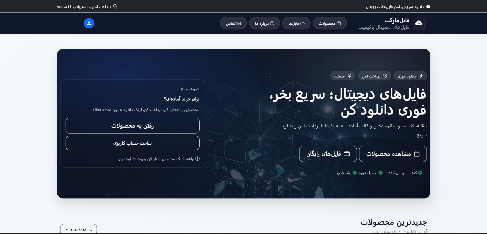
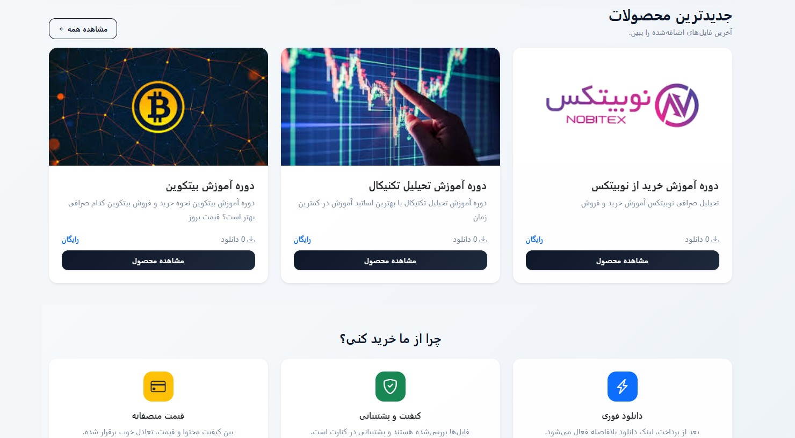
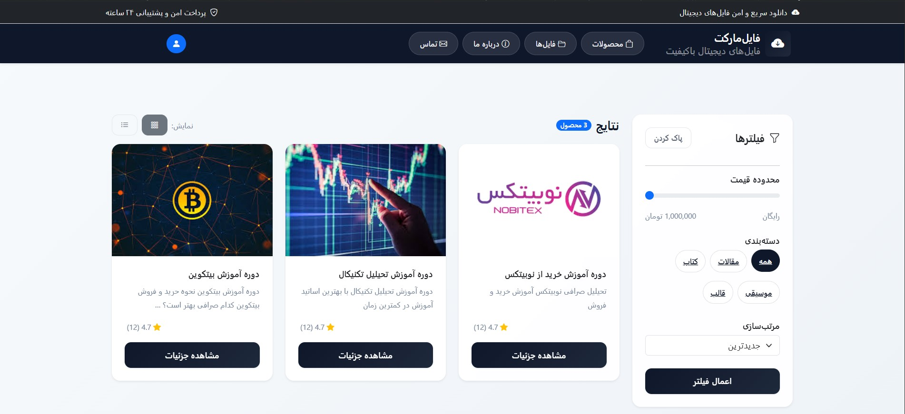
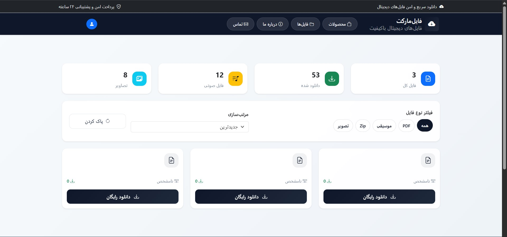
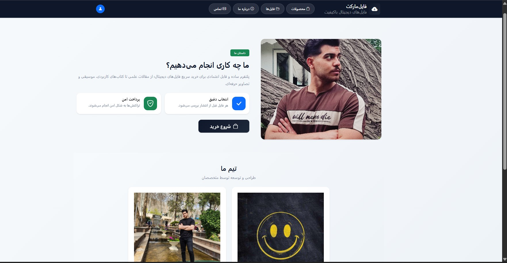
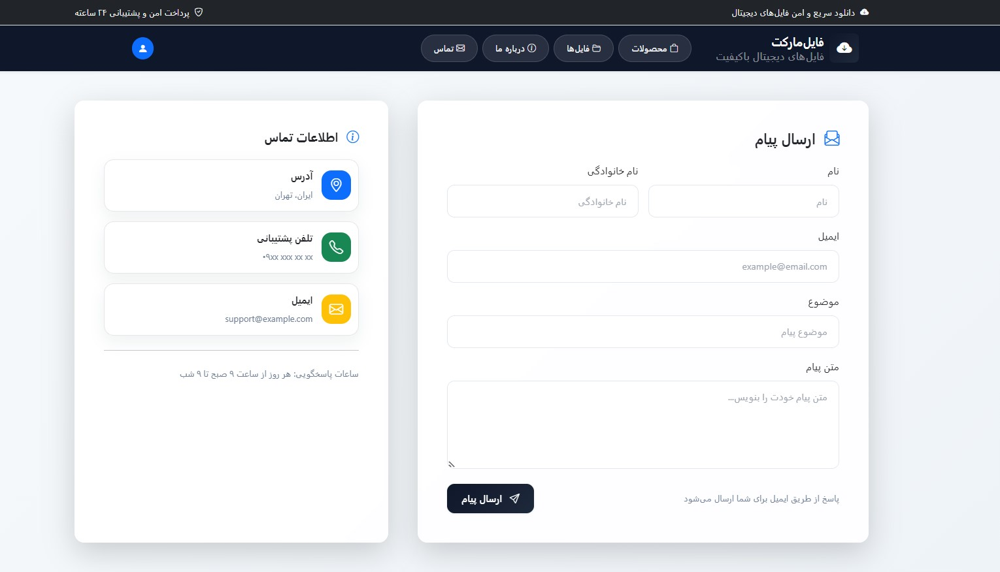
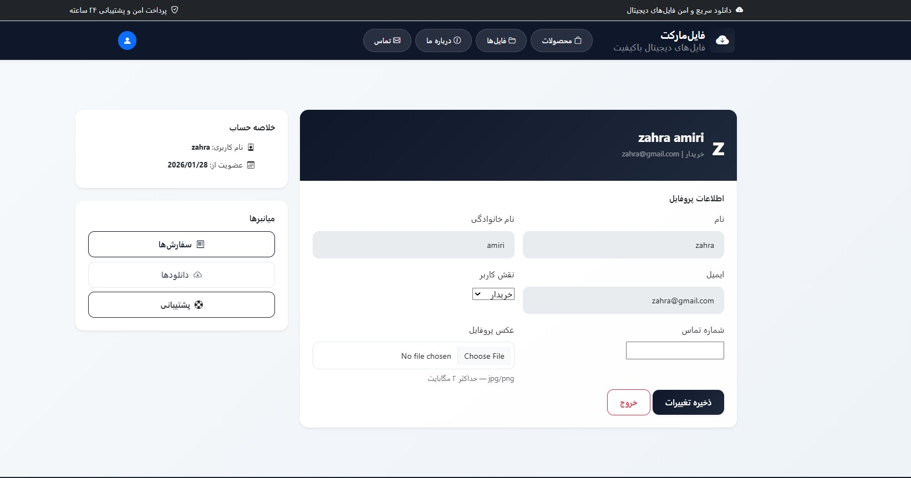
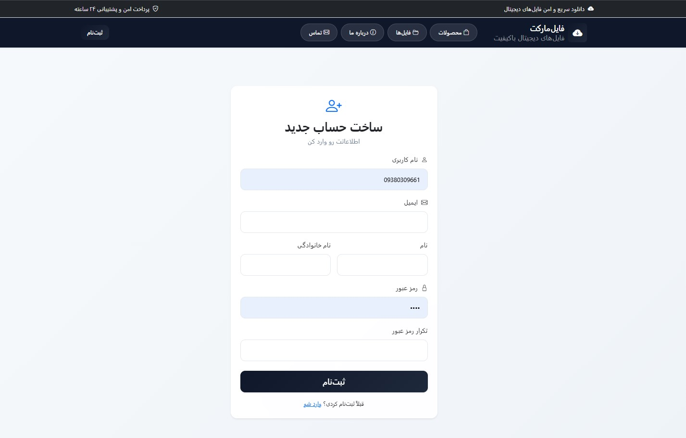
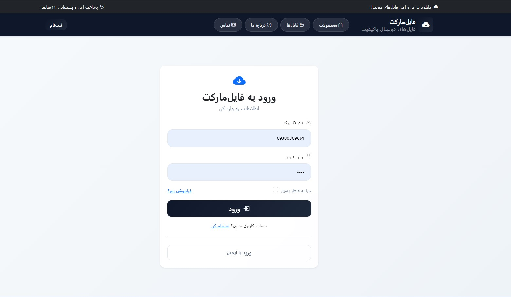
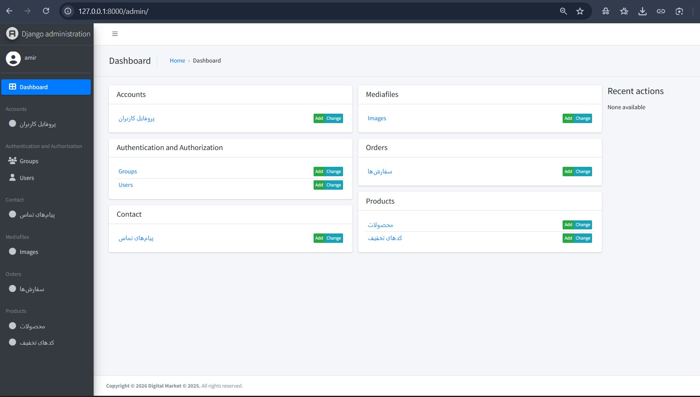

# Digital Web (Django)

فروشگاه فایل‌های دیجیتال با Django + Template

## Preview (Screenshots)

<p align="center">
  
</p>

<p align="center">
  
  
</p>

<p align="center">

</p>

<p align="center">
  
  
</p>

<p align="center">
  
  
</p>

<p align="center">
  
  
</p>


## Run locally

```bash
python -m venv venv
# Windows
venv\Scripts\activate
pip install -r requirements.txt
python manage.py migrate
python manage.py runserver
